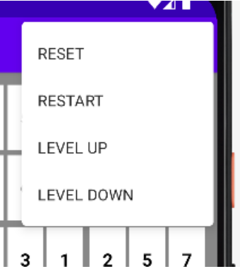
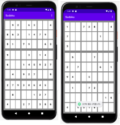
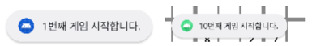
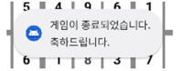
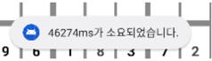

## 스도쿠 프로젝트 🧩
### 프로젝트 설명
- 모바일 프로그래밍 수업 과제
- 스도쿠 게임 안드로이드 어플

### 핵심 구현 기능
- 1부터 9까지의 숫자를 이용하여 9X9칸을 채운다. 
- 같은 열과 행 그리고 3X3칸 중에서 숫자를 중복되지 않아야 한다.
- 메모 기능을 이용하여 숫자 후보를 각 칸에 표시할 수 있다.

### 추가 구현 기능

1. RESTART
- 게임을 처음부터 다시 시작할 수 있도록 하는 기능
- 숫자 배열 재생성
2. RESET
- 지금까지 입력한 숫자들을 모두 지워주는 기능
3. LEVEL UP & LEVEL DOWN
- 게임을 시작할 때 보여지는 숫자의 개수를 조절하여 LEVEL을 더 높이거나 낮출 수 있는 기능
- 특정 임계값에 닿으면 더 이상 올릴 수 없음

4. 게임 횟수
- RESTART를 통해 앱을 실행하고나서 몇 번 게임을 시작 및 재시작 했는지 계산
- 게임 시작시 토스크 메시지 알림

5. 게임 성공 여부
- 모든 숫자를 성공적으로 채웠다면, 토스트 메시지로 알림

6. 게임 소요 시간
- 게임을 성공할 때까지 소요된 시간을 게임 종료 토스트 메시지 알림

